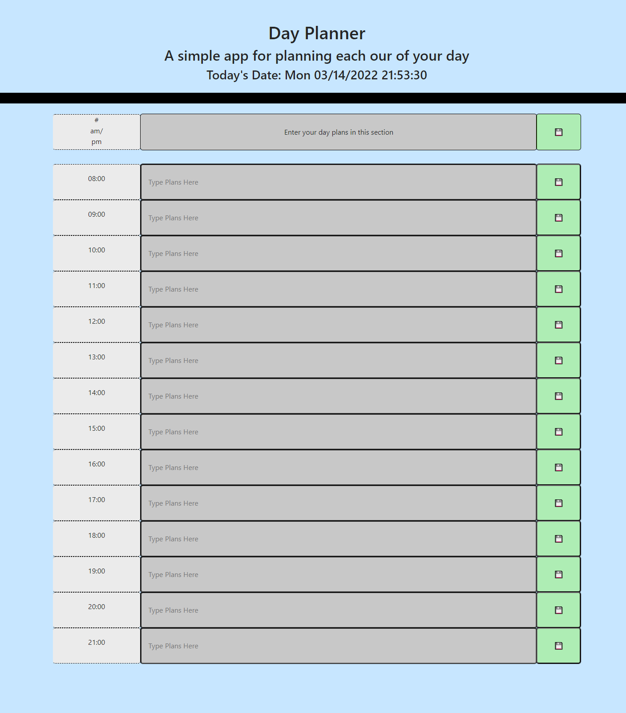

# day-planner

## Objectives

The purpose of this assignment was to create a program in javascript that will act as a day planner. Each section of the day planner will display a different hour of the day. The user will be able to enter in their plans for each hour of the day and save it to a list.

## Screenshot of Final Page

## Link to the Final Page and GitHub

[Here is a link to my final page](https://jandrewanderson.github.io/day-planner/)

[Here is the link to my Github Repository](https://github.com/jandrewanderson/day-planner)

### Contributions

Joseph Andrew Anderson

### Resources

https://www.w3schools.com/html/html5_semantic_elements.asp
https://www.pluralsight.com/guides/semantic-html
https://stackoverflow.com

My tutor: Abdullah Al Hilfi

### License

This code is licensed under the MIT License.